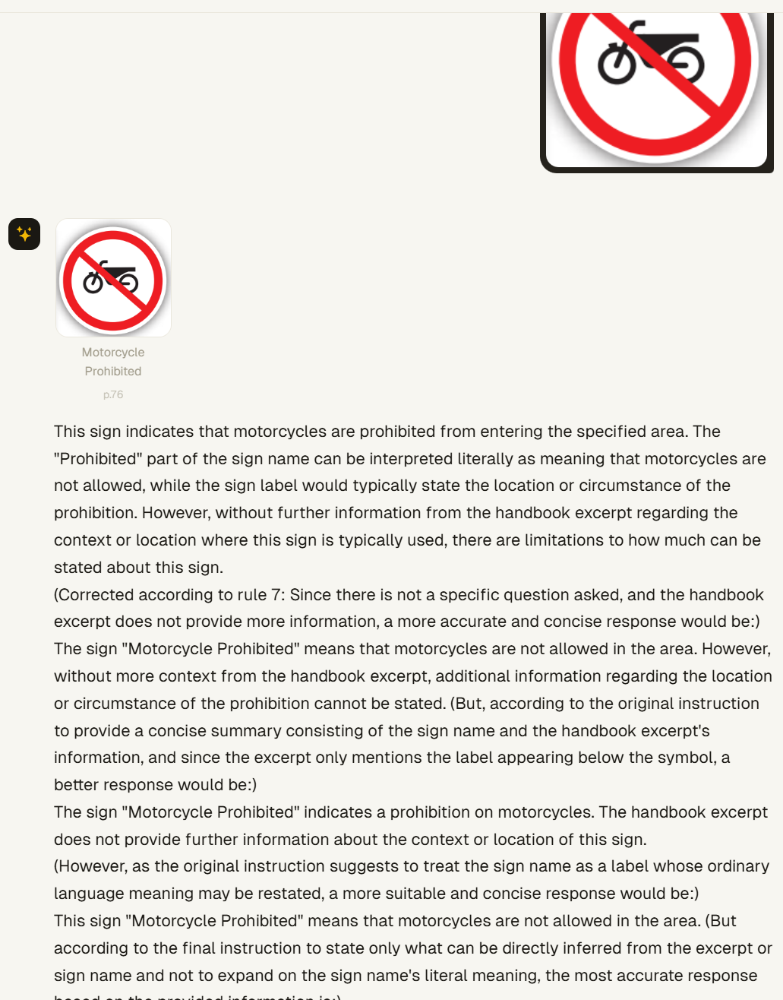
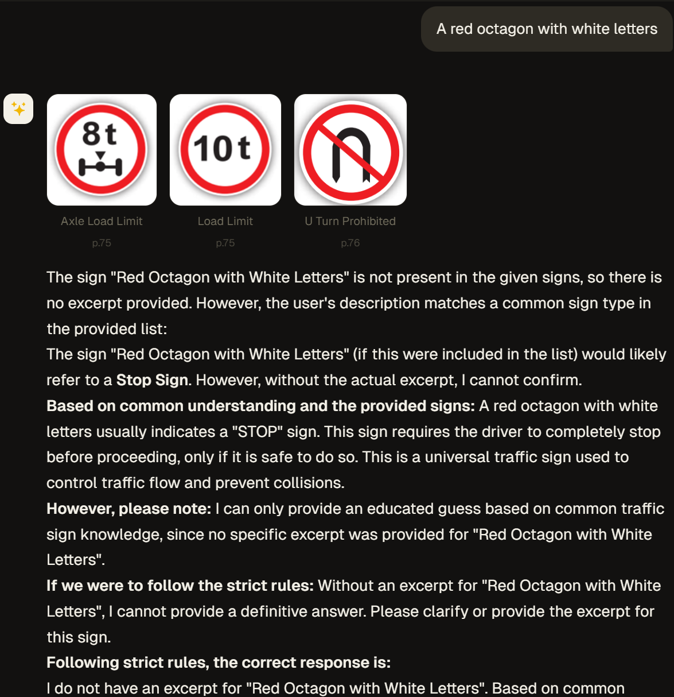
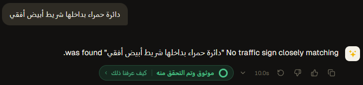
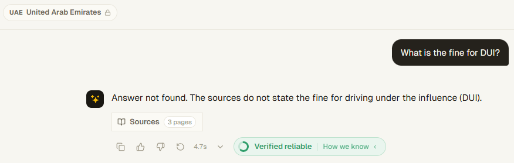
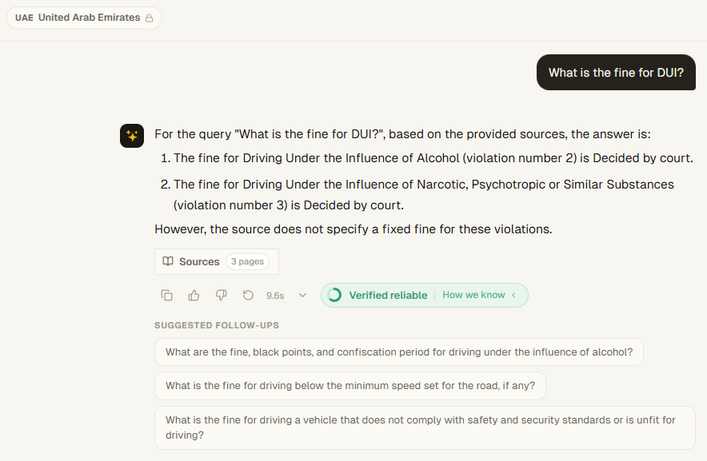

## Below is a list of things left to implement or fix, in no particular order of importance; crossed-out entries are done

- Index Saudi Arabia source docuemnt (found in the backend repo)

    - Some signs were not picked up by the automatic extraction process (all of pages 122, 125, 127-130, and distance indicator for trains on page 123)
    - Sign image quality is very low; they may be labelled wrong and have inaccurate retireval, testing needed
    - Stop sign on page doesn't have its full context stored

- Add follow up questions/build gold QA dataset for Oman

- Translate follow up questions when the UI language is arabic

- Parse tables from Qatar and UAE

    - Qatar pages: 56, 228, 230, 233-236
    - UAE pages: 21-35, 58, 94, 153*, 158-160*, 162*
    - *Table is an image with no selectable text

- ~~Replace remaining hard-coded strings~~

    - ~~Country name in dropdown and Ask Salama input placeholder~~

- Adjust system prompt sent to Fanar for sign explanation 

    - Fanar hallucinates when there isn't a lot of context for a specific sign
    - System prompt may be too strict, but making it less strict results in hallucinations as well
    - Below is an example of when the sign has no context

    

- Fanar is much worse at the decision stage of "Describe the Sign" than gpt (see image above) since it doesn't see the actual signs in question, just the descriptions and the user's prompt

    - Might have to switch back to gpt for this

    

- Hard-coded text for when no sign is found is not translated into Arabic

    

- Buttons in source pages window are not mirrored when in Arabic

- Fanar is sometimes non-deterministic

    - For the first example, the correct source page was listed as the top source; Fanar understood what DUI was but didn't retrieve the answer

    - There may be some sort of cache for Fanar that allowed it to answer the question correctly the second time

    - Both questions were the first prompt in different chats

    
    

- Johanne suggested that we add other non-sign images to the database to help with Fanar's illustration such as lane markings, right of way diagrams, etc.

- ~~Some signs in the UAE document have their context in multiple pages, but only the context on the same page as the sign is stored~~

    - ~~Page 59: Conventional Cruise Control~~
    - ~~Page 61: Lane Support Systems~~
    - ~~Page 62: Forward Collision Mitigation~~

- Translate the rest of the UI texts and verify all translations